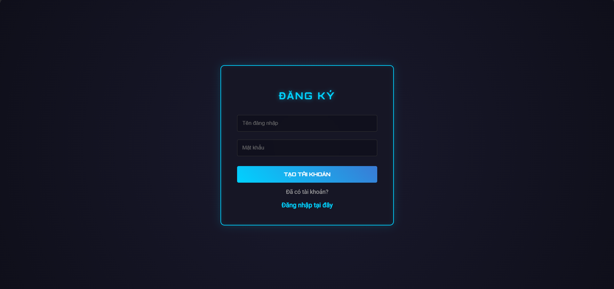
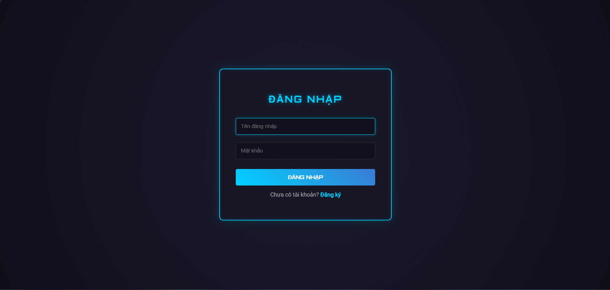
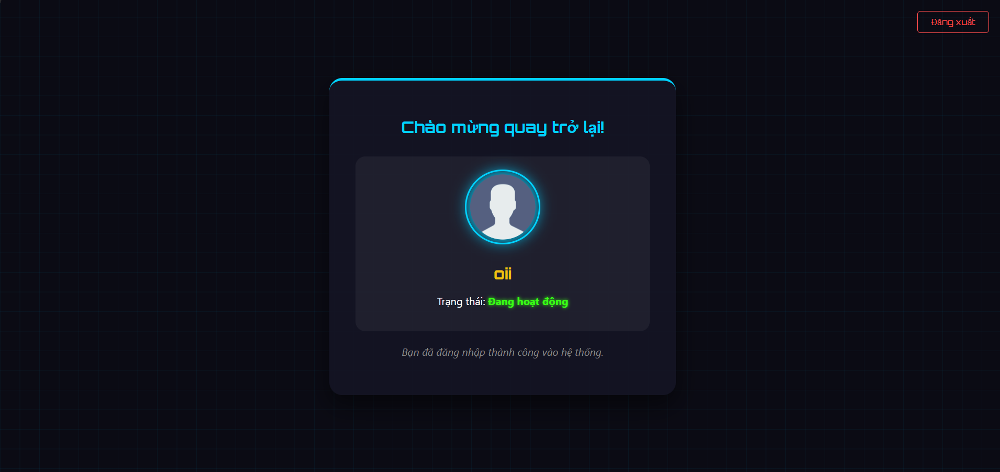
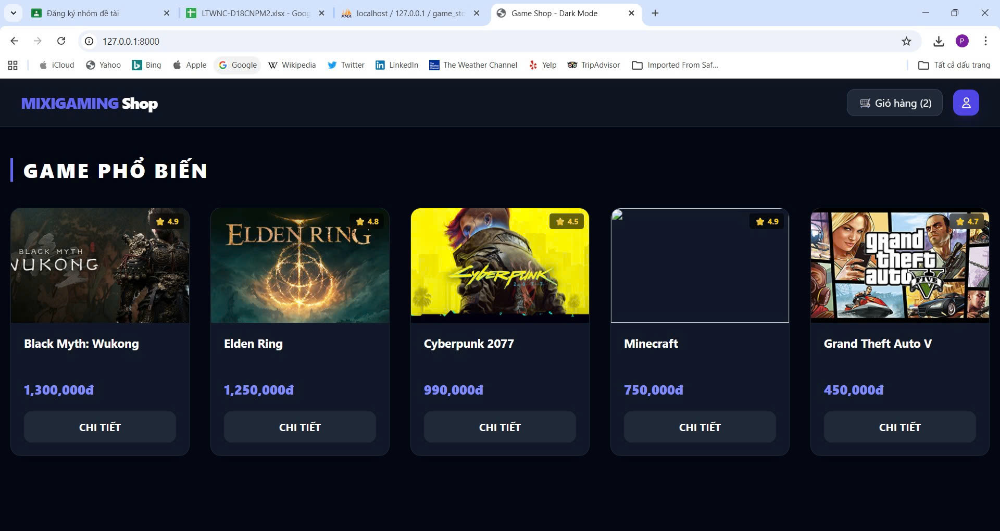
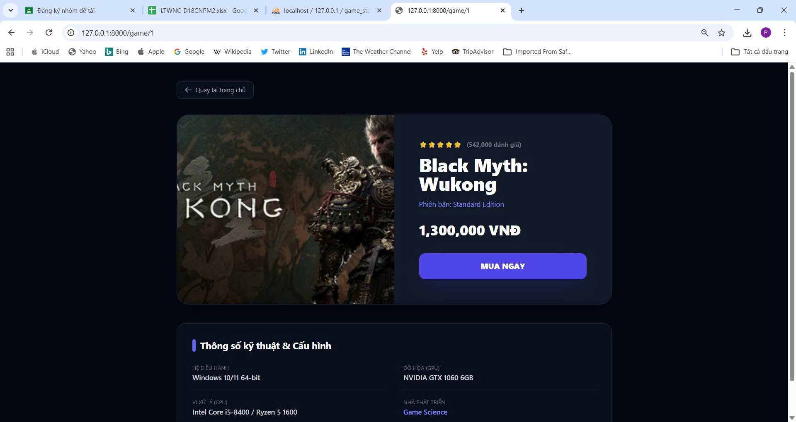
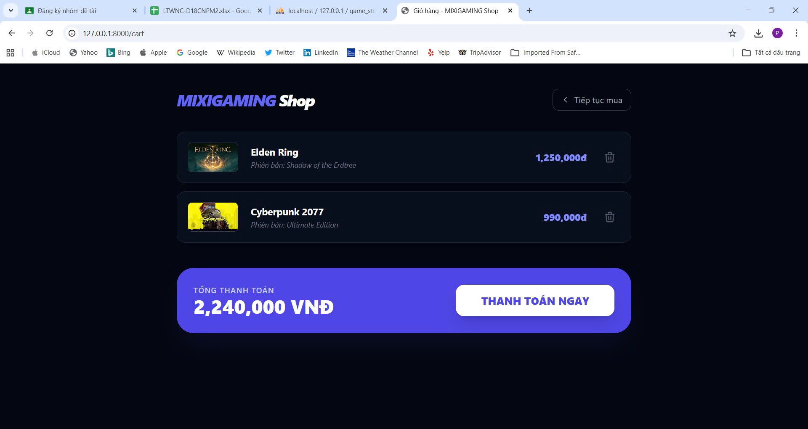

# DAILY REPORT - [03/04/2026]

[cite_start]**Dự án:** Xây dựng website bán game – MIXIGAMING Shop [cite: 1]  
[cite_start]**Nhóm:** [Nhóm 13] [cite: 1]

---

## [cite_start]TỔNG HỢP TIẾN ĐỘ HÔM NAY 03/04/2026 [cite: 3]

| Thành viên | Chức năng phụ trách | Trạng thái | Ghi chú |
| :--- | :--- | :--- | :--- |
| Nguyễn Trung Hiếu | Giao diện trang chủ, trang chi tiết game | [cite_start]✅ Hoàn thành | [cite: 4] |
| Nguyễn Trọng Phúc | Giao diện mua sản phẩm, thanh toán | [cite_start]✅ Hoàn thành | [cite: 4] |
| Nguyễn Hữu Thành | Giao diện đăng ký, đăng nhập | [cite_start]✅ Hoàn thành | [cite: 4] |

---

## HÌNH ẢNH MINH HỌA GIAO DIỆN

### [cite_start]1. Giao diện đăng ký & đăng nhập [cite: 5]
* **Màn hình Đăng ký:**

* **Màn hình Đăng nhập:**

* **Thông báo thành công:**

---

### [cite_start]2. Giao diện Trang chủ & Chi tiết Game [cite: 6]
* **Trang chủ MIXIGAMING Shop:**

* **Chi tiết sản phẩm (Black Myth: Wukong):**

---

### [cite_start]3. Giao diện Mua hàng & Thanh toán [cite: 7]
* **Giỏ hàng của người dùng:**

---
[cite_start]*Báo cáo được thực hiện bởi Nhóm 13 vào ngày 03/04/2026.* [cite: 1, 3]
